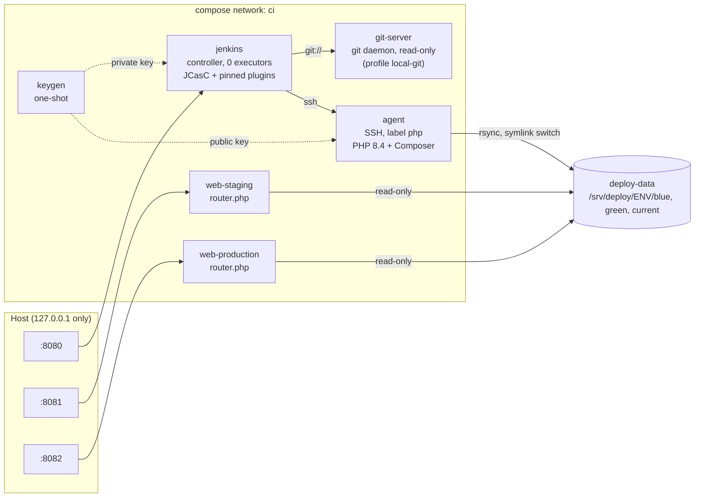
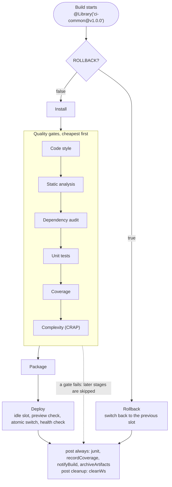
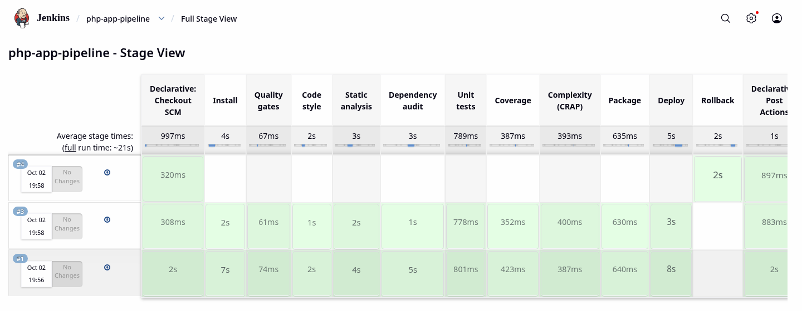
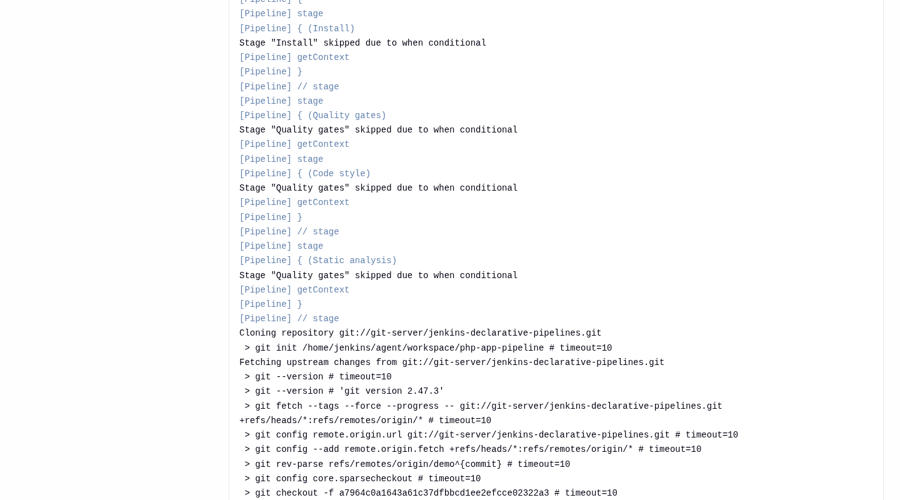

# jenkins-declarative-pipelines

A declarative Jenkins pipeline with a tested shared library, quality gates and a blue-green deploy with rollback, running end to end on your machine with one `make up`.

[](https://github.com/tayguara/jenkins-declarative-pipelines/actions/workflows/ci.yml)
[](LICENSE)

## What this is and why

I built this repository to show the Jenkins setup I would put in front of a client: a short Jenkinsfile that says *what* runs, a shared library that holds *how* it runs, and tests for both. It is the working companion of my article [From scripted to declarative: what 10+ years of Jenkins pipelines taught me](https://dev.to/tayguara/from-scripted-to-declarative-what-10-years-of-jenkins-pipelines-taught-me-about-shared-libraries-2k40). Every design decision in the article has a counterpart in this code, mapped in [Design decisions](#design-decisions).

Everything runs locally, with no accounts, no cloud and no real servers. `docker compose` starts a Jenkins controller, an SSH build agent with PHP, a git server and two web servers that play the roles of staging and production. The sample application is a small PHP service with a SemVer endpoint, so the gates have real code to check.

It is small on purpose: 7 library steps, 5 helper classes, a Jenkinsfile of about 110 lines and a PHP application with 7 classes.

## At a glance

| Concept | Where it lives |
| --- | --- |
| The pipeline (the *what*) | [`Jenkinsfile`](Jenkinsfile), zero `script {}` blocks |
| Shared library `ci-common` (the *how*) | [`shared-library/`](shared-library): 7 steps in `vars/`, 5 pure classes in `src/` |
| Library and pipeline tests | [`shared-library/test/`](shared-library/test): 158 JenkinsPipelineUnit tests, including the real Jenkinsfile |
| Quality gates | Code style, static analysis, dependency audit, unit tests, coverage, CRAP |
| Blue-green deploy and rollback | [`deployBlueGreen`](shared-library/vars/deployBlueGreen.groovy) and [`deploy/web/router.php`](deploy/web/router.php) |
| Config as data | [`config/environments/*.yaml`](config/environments), no secrets |
| Jenkins as code | [`jenkins/casc/jenkins.yaml`](jenkins/casc/jenkins.yaml): security, agent, credentials, library, job |
| Sample application | [`app/`](app): PHP 8.4, 65 tests, 100% line coverage, 99% mutation score |
| Local stack | [`compose.yaml`](compose.yaml) and the [`Makefile`](Makefile) |
| End-to-end test | [`scripts/smoke-test.sh`](scripts/smoke-test.sh): three real builds through the REST API |
| CI for this repository | [`.github/workflows/`](.github/workflows) |

## Tech stack

Versions are the ones in use at the time of writing. The manifests (`plugins.txt`, `composer.lock`, `build.gradle`, `package-lock.json`) are the source of truth.

| Tool | Version | Used for |
| --- | --- | --- |
| [Jenkins](https://www.jenkins.io) controller | 2.580.1 LTS, Java 21 | Runs the pipeline. Plugins are pinned in [`plugins.txt`](jenkins/controller/plugins.txt) |
| `jenkins/ssh-agent` | 9.0.0, Java 21, Debian 13 | Build agent over SSH, with PHP 8.4 (+ pcov) and Composer 2.10 |
| [Configuration as Code](https://github.com/jenkinsci/configuration-as-code-plugin) and Job DSL | 2131 and 3732 | Configures Jenkins and creates the job, with no clicks |
| PHP | 8.4 | Sample application |
| PHPUnit, PHPStan, PHP CS Fixer | 13.4, 2.2 (`level: max`), 3.95 | Tests, static analysis, style |
| Infection | 0.35 | Mutation testing (GitHub Actions only) |
| Gradle wrapper | 9.8.0 | Builds and tests the library |
| [JenkinsPipelineUnit](https://github.com/jenkinsci/JenkinsPipelineUnit) | 1.31 | Unit tests for steps and for the Jenkinsfile |
| Groovy | 2.4.21 | Same version as Jenkins core, used by the library and its tests |
| npm-groovy-lint | 18.0.0 | CodeNarc lint for the Jenkinsfile and the library |
| Docker Compose | v2 | Local stack |

## Quickstart

Requirements: Docker with Compose v2, GNU make, `curl`, `jq`, and about 4 GB of free RAM. Ports 8080, 8081 and 8082 on `127.0.0.1` (configurable in `.env`).

```bash
git clone https://github.com/tayguara/jenkins-declarative-pipelines.git
cd jenkins-declarative-pipelines

install -m 600 .env.example .env   # the file will hold real secrets
# Fill the three secrets with random values (GNU sed; on macOS edit .env by hand):
for v in JENKINS_ADMIN_PASSWORD DEPLOY_TOKEN_STAGING DEPLOY_TOKEN_PRODUCTION; do
  sed -i "s|^$v=.*|$v=$(openssl rand -hex 24)|" .env
done

make up
```

`make up` checks `.env`, syncs a local git mirror, builds the images that changed and waits until everything is healthy. The first run downloads the Jenkins plugins and takes a few minutes; a run on a clean state with warm image caches takes under a minute, and repeating `make up` on a running stack with nothing changed takes a few seconds and recreates nothing.

Then:

1. Open <http://localhost:8080> and log in as `admin` with the password from `.env`. There is no setup wizard.
2. Run the job `php-app-pipeline` with **Build Now**. It runs on the `php-agent` node, passes the gates and deploys to staging. Open <http://localhost:8081> to see the release (`release <sha> (build 1) on blue`).
3. Run it again: the release lands on `green`. Then use **Build with Parameters** with `ROLLBACK` ticked. The gates are skipped and staging goes back to `blue` in a few seconds.
4. Or run all of it unattended with `make smoke` (about 2 minutes with warm images).

| Command | What it does |
| --- | --- |
| `make up` | Validates `.env`, syncs the git mirror, builds the images whose files changed and starts the stack. Safe to repeat |
| `make build` | Forces a rebuild of the images and pulls newer base images (the next `make up` recreates the containers) |
| `make smoke` | End-to-end test: lint the Jenkinsfile, run three builds, check the web servers and look for leaked secrets |
| `make validate` | Lints the Jenkinsfile with the real declarative linter of the running Jenkins |
| `make sync` | Refreshes the git mirror, so Jenkins builds your latest commit |
| `make test` | Library tests (`./gradlew test`) and the PHP checks (`composer -d app check`) |
| `make lint` | Groovy lint, hadolint, shellcheck, actionlint and `docker compose config` |
| `make down` | Stops the stack and keeps the volumes |
| `make clean` | Stops the stack and **deletes** the Jenkins home, the releases and `.demo/` |

To run the tests outside Docker you need Java 21, Node 22 (`.nvmrc`), PHP 8.4 and Composer.

**Contributor note.** Jenkins builds what is committed: `make sync` points the `demo` branch of the mirror at your current `HEAD`, and it warns when the working tree is dirty. To try uncommitted changes, run `INCLUDE_WORKTREE=1 make sync`: it pushes a throw-away snapshot of the working tree to the local mirror only, and commits nothing here.

With the local mirror you never need `PIPELINE_BRANCH`: `make sync` points `demo` at your current `HEAD`, whichever branch that is. To build another branch of a remote repository, set `REPO_URL` and `PIPELINE_BRANCH` in `.env` and run `make up`. Both are read when the controller container starts (JCasC), so changing them needs that `make up`; it only recreates the controller, and the agent keeps its keys, so it is safe.

### Using GitHub instead of the local git server

The default `REPO_URL` points at the `git-server` container, which serves a mirror of your clone. To make Jenkins read from GitHub, set these in `.env` and run `make up`:

```dotenv
REPO_URL=https://github.com/tayguara/jenkins-declarative-pipelines.git
PIPELINE_BRANCH=main
```

`make up` then skips the mirror and does not start the `git-server` service.

## Architecture



Volumes: `jenkins-home`, `deploy-data`, and three for the SSH keys, each mounted only where it is needed. `agent-key-private` goes to the controller only (the client private key and the agent's public host key), `agent-key-public` to the agent only (the client public key), and `agent-host-key` to the agent only (the agent's host private key, owned by root with mode `0400`, so build code running as the `jenkins` user cannot read it). The SSH keys (the client key pair and the agent's host key pair) are generated per stack by the `keygen` service, only when they are missing, so running it again changes nothing. They are never committed and do not exist in `.env`.



## The pipeline

The stages run from the cheapest check to the most expensive. A bad commit fails on style or types in seconds, before anything slow starts.

| Gate | Tool | Report (under `app/reports/`) | Threshold | Relative cost |
| --- | --- | --- | --- | --- |
| Code style | PHP CS Fixer | `php-cs-fixer.xml` (checkstyle) | no violations | seconds |
| Static analysis | PHPStan `level: max` | `phpstan.json` | no errors | seconds |
| Dependency audit | `composer audit --locked` | `composer-audit.json` | no advisories | seconds |
| Unit tests | PHPUnit with pcov | `junit/phpunit.xml`, `coverage/cobertura.xml`, `coverage/crap4j.xml` | all pass | the real cost |
| Coverage | `coverageGate` | reads `cobertura.xml` | line coverage >= 80% | almost free |
| Complexity (CRAP) | `crapGate` | reads `crap4j.xml` | CRAP <= 30 per method | almost free |

Coverage and CRAP do not run anything. They read the files the unit tests already produced, which is why they sit after the tests and cost almost nothing. The thresholds belong to the pipeline, not to a plugin: `recordCoverage` only draws the coverage charts, while the gate is our own, portable code with a message that says what to do.

After the gates, `Package` builds a release directory (`app/bin/package`) and `Deploy` ships it. With `ROLLBACK=true`, `Install`, `Quality gates`, `Package` and `Deploy` are skipped by `when`, and `Rollback` runs instead. Skipped stages stay visible in the stage view. On a rollback run the `post` steps find no test report and no coverage report, so the log shows "No test report files were found" and "No coverage results were found". That is expected: the build is still `SUCCESS`, and the plugins do not offer a way to silence the messages.

The `post { always }` block runs in this order: `junit`, `recordCoverage`, `notifyBuild`, `archiveArtifacts`. The summary (`build-summary.md`) is a file written by `notifyBuild`, so it has to exist before it is archived. A test in `JenkinsfileTest` fails if the order changes.

## The shared library

`ci-common` is a global library with its code under `shared-library/`, not at the repository root. Jenkins reads it through `libraryPath: shared-library/`.

| Step | Signature | What it does |
| --- | --- | --- |
| `runGate` | `runGate(name:, command:, report:, type: null)` | Runs a command that writes a report, saves a gate record, and fails with `<name> gate failed (exit code N). Findings: <report>` |
| `coverageGate` | `coverageGate(report:, min:)` | Parses the Cobertura report and fails below `min` |
| `crapGate` | `crapGate(report:, max: 30)` | Parses the crap4j report and lists the methods above `max` |
| `loadEnvConfig` | `Map loadEnvConfig(String name)` | Reads `config/environments/<name>.yaml` with `readYaml` and checks the required keys |
| `smokeCheck` | `smokeCheck(url:, credentialsId:, slot: null)` | Calls a health URL with the deploy token, optionally for one slot, and returns `[ok, status, slot, version]`. Never fails the build |
| `deployBlueGreen` | `deployBlueGreen(environment:, buildDir: null, rollback: false, report: null)` | Deploys to the idle slot or rolls back, with a check before and after the switch |
| `notifyBuild` | `notifyBuild(reportsDir:)` | Writes the markdown summary, the build description and an echo. Never changes the build result |

The classes in `src/io/github/tayguara/ci/` (`Args`, `Reports`, `GateRecords`, `BuildSummary`, `BlueGreen`) hold the logic that has no Jenkins in it: argument checks, report parsers, the summary renderer and the colour rules. They are plain Groovy, marked `@NonCPS`, and tested without a pipeline.

**Pinning.** The Jenkinsfile loads `@Library('ci-common@v1.0.0') _`. The library definition in JCasC sets `defaultVersion: main` and `allowVersionOverride: true`, so a Jenkinsfile with no version follows `main` (a canary) while production-grade pipelines pin a tag. To release a new version: merge to `main`, tag it, then open a pull request that raises the pin. On a fresh local mirror the tag may not exist yet; `make sync` then creates it **in the local mirror only**, with a `DEMO ONLY` warning. The real tag is created at release time.

**Why the tests are not in `src/test/`.** `pipeline-groovy-lib` strips `src/test/` from the retrieved library, so the tests live in `shared-library/test/`, and the Gradle build points its source sets there.

**Trust.** A global library runs outside the Groovy sandbox, so it is trusted code: whoever can change what Jenkins loads as `ci-common` can run code on the controller. With `allowVersionOverride: true`, which pinning to a tag needs, that includes write access to **any ref** of the library repository, because a Jenkinsfile can load `@Library('ci-common@<any branch or tag>')`. So:

- protect the tags and the default branch, and require review (CODEOWNERS helps);
- do not combine a trusted library with multibranch or pull-request builds, where a contributor's Jenkinsfile can name any ref;
- or keep the library in a separate repository with restricted write access, which also gives it its own release cycle.

## Design decisions

Each decision maps to a section of the [companion article](https://dev.to/tayguara/from-scripted-to-declarative-what-10-years-of-jenkins-pipelines-taught-me-about-shared-libraries-2k40).

| Decision | Article section | Where it is here |
| --- | --- | --- |
| The library holds *how*, the Jenkinsfile holds *what* | Shared libraries as the backbone | `vars/` steps and the 110-line Jenkinsfile |
| Pin the library to a tag, let a canary follow `main` | Shared libraries as the backbone | `@Library('ci-common@v1.0.0')` and `defaultVersion: main` in JCasC |
| Report-first gates with actionable messages | Quality gates before a blue-green deploy | `runGate`, `coverageGate`, `crapGate` |
| Cheapest gates first | Quality gates before a blue-green deploy | Stage order in the Jenkinsfile |
| Mutation testing outside the deploy pipeline | Quality gates before a blue-green deploy | `Mutation testing` job in `ci.yml` |
| `post` instead of `try/catch` | 2021: going declarative | `post { always }` and `cleanup`, and a test that forbids `try` and `catch` |
| `when` instead of `script { return }` | 2021: going declarative | `when` on the five top-level stages, zero `script {}`, and a test that enforces it |
| The summary is built in `post { always }` from gate records | Quality gates before a blue-green deploy | `notifyBuild` and `GateRecords` |
| Validate before running | 2021: going declarative | `make validate` and the linter step of `make smoke` |
| Config is data (`readYaml`), secrets are credentials | Environment config without secrets | `config/environments/*.yaml` and `withCredentials` in `smokeCheck` |
| Single quotes around secrets in `sh` | Environment config without secrets | `smokeCheck` passes the token through the environment and to curl on stdin |
| Blue-green with an atomic switch and rollback by parameter | Blue-green with rollback | `deployBlueGreen`, `BlueGreen`, `ROLLBACK` |
| Tests with JenkinsPipelineUnit | Scripted vs declarative | 158 tests in `shared-library/test/` |
| Linter step in the pipeline repository | When to migrate, and how to do it safely | `npm run lint:groovy` and the declarative linter in the smoke test |

### Blue-green, as it is built here

Each environment has two directories, `blue` and `green`, and a relative symlink `current` that points to the live one. A deploy:

1. reads which colour is live (`readlink`) and picks the other one as the target;
2. copies the release into the idle directory with `rsync -a --delete`;
3. calls the idle slot through the router with an `X-Slot` header and the deploy token (a preview), and stops if it is not healthy, leaving the live slot untouched;
4. creates `current.next` and renames it over `current` with `mv -Tf`, which is atomic (`ln -sfn` alone is not: it removes the link and creates it again);
5. checks the live URL and, if it is not healthy or serves the wrong slot, switches back and fails the build.

Rollback is the same switch in reverse, with no copy. It fails with a clear message when nothing is live yet or when the other slot holds no release.

The article lists three caveats, and they hold here. Rollback goes back exactly one release. The symlink rolls back code, not data, so migrations must be backward compatible. And the live colour is read from the symlink, which is the single source of truth.

This is a simulation, and the router is its honest weak point: PHP's built-in server stands in for nginx plus php-fpm. In production the equivalent of `-d realpath_cache_size=0` and `clearstatcache()` in `router.php` is reloading php-fpm after the switch, so that no worker keeps serving the old path from its cache. In a company, `deployBlueGreen` and `smokeCheck` would live in a product library next to the common one, as in the article.

## Use the library in your own Jenkins

With Configuration as Code:

```yaml
unclassified:
  globalLibraries:
    libraries:
      - name: ci-common
        defaultVersion: main
        allowVersionOverride: true
        retriever:
          modernSCM:
            libraryPath: shared-library/
            scm:
              git:
                remote: "https://github.com/tayguara/jenkins-declarative-pipelines.git"
                traits:
                  - gitBranchDiscovery
                  - gitTagDiscovery
```

Or in the UI: **Manage Jenkins > System > Global Trusted Pipeline Libraries**, with the same name, a **Modern SCM** retriever, the repository URL and `shared-library/` as the library path. Then:

```groovy
@Library('ci-common@v1.0.0') _
```

A library configured under *Manage Jenkins* is global, so its code is trusted and runs outside the sandbox. A library configured on a folder runs sandboxed, which is safer for code you did not write, but the steps here (`sh`, `readYaml`, credentials) then need script approvals.

## Security notes

- **No Docker socket.** No service mounts the Docker socket and none is privileged. PHP runs natively on the agent, so a build cannot control the host's Docker.
- **The controller runs nothing.** `numExecutors: 0`: a build on the controller could read `JENKINS_HOME` and its secrets. All builds run on `php-agent`, over SSH.
- **Secrets are files, not environment variables.** `make up` validates `.env` (required, at least 16 characters, no placeholders, two different tokens, no `"` or `\`), sets its mode to `0600` and writes `.demo/secrets/*`, which compose mounts under `/run/secrets`. JCasC reads them with `${readFile:...}`. `docker inspect` and `docker compose config` show no secret. I first tried compose's `environment:` secrets, which do read `.env`, but compose refuses them for `read_only` services, so the file form is used. The secret files are `0644` inside a `0700` directory, so the container user can read them whatever the host uid is.
- **Credentials per environment.** `deploy-token-staging` and `deploy-token-production` are separate. A staging build uses only its own token.
- **Masking and quoting.** `smokeCheck` uses `withCredentials` with a single-quoted `sh`, so Jenkins can mask the token and Groovy never interpolates it. The token goes to `curl` as a config line on stdin, not on its command line. `make smoke` also greps every console log and `docker inspect` for the secret values.
- **CSRF.** The default crumb issuer is on, and the scripts use a session cookie and a crumb. Credentials reach `curl` through `--config -`, never through `argv`.
- **XXE.** The report parsers disable external DTDs and entities, and a test with an XXE fixture proves nothing external is resolved.
- **Global library is trusted code.** See [The shared library](#the-shared-library).
- **Pinned agent host key.** `keygen` creates the agent's SSH host key once and keeps it in a volume that only the agent mounts, root-owned and unreadable by the build user. The agent's `sshd` reads it from there, and JCasC pins its public half (`manuallyProvidedKeyVerificationStrategy`), so the controller does not trust whatever key it sees first, and recreating the agent container keeps the trust intact. The controller never receives the private half. A changed pin takes effect on the next reconnect of the agent.
- **Localhost only.** Published ports are bound to `127.0.0.1`. `git-server` and `agent` publish no ports. Hardening: `cap_drop: [ALL]`, `no-new-privileges` and read-only root filesystems where the service allows it. The agent needs a few capabilities because `sshd` starts as root.
- **Untrusted input.** `runGate` runs `command` in a shell, so it must come from the reviewed Jenkinsfile and never from a build parameter. Report paths and environment names are validated against path traversal.

What would change in production: TLS in front of Jenkins, SSO instead of a local user, ephemeral agents, a vault for secrets, images pinned by digest, workflow actions pinned by commit SHA, and a locked plugin set.

## Testing and CI

```bash
./gradlew test                                    # 158 tests: library and the real Jenkinsfile
npm ci && npm run lint:groovy                     # CodeNarc, warnings fail
composer -d app install && composer -d app check  # style, PHPStan, audit, PHPUnit
composer -d app mutation                          # Infection, MSI >= 80 (99% today)
make lint                                         # hadolint, shellcheck, actionlint, compose config
make up && make smoke                             # the whole stack, three real builds
```

The sample app has 65 tests, 100% line coverage and a highest CRAP score of 8. Infection reports a mutation score of 99%.

`.github/workflows/ci.yml` runs one check per job, and the end-to-end job waits for the fast ones:

| Check | What it does |
| --- | --- |
| `Library tests` | `./gradlew test` with Java 21, the Gradle wrapper validated, a report uploaded on failure |
| `Groovy lint` | `npm run lint:groovy` |
| `PHP gates` | `composer validate --strict`, `composer check`, and a coverage summary |
| `Mutation testing` | `composer mutation`, after `PHP gates` |
| `Lint (Docker, shell, compose)` | hadolint on the three Dockerfiles with `.hadolint.yaml`, shellcheck and `docker compose config` |
| `Jenkins end-to-end` | Generates a throw-away masked `.env`, runs `make up` and `make smoke`, uploads the logs on failure, always runs `docker compose down -v` |

Other workflows: `CodeQL (actions)`, `Dependency review`, `actionlint` and `Dependency submission` (Gradle, for the dependency graph). CodeQL does not analyze PHP or Groovy, so that coverage comes from PHPStan, `composer audit` and CodeNarc. Dependabot covers Gradle, Composer, npm, Docker, docker-compose and GitHub Actions. It does not cover the Jenkins plugins: bump `plugins.txt` once a month with `jenkins-plugin-cli --available-updates`, then run `make smoke`.

All workflows use `contents: read` by default, a concurrency group, `persist-credentials: false`, timeouts, and no `pull_request_target`.

### The smoke test

`make smoke` is the proof that the pieces work together. It logs in, waits for `php-agent`, lints the Jenkinsfile with the real declarative linter, then runs three builds through the REST API:

1. The defaults: all gates pass, 65 tests are published, coverage is visible, `build-summary.md` is archived, staging serves `blue`, and the log shows `ci-common@v1.0.0` loaded and `Running on php-agent`.
2. A second deploy: staging serves `green`.
3. `ROLLBACK=true`: `Quality gates` is skipped by `when` and staging serves `blue` again.

It also checks `/health` (401 without the token, 200 with it) and fails if any secret appears in a console log or in `docker inspect`. The linter and the smoke test cover what JenkinsPipelineUnit cannot: declarative syntax and real plugins.

## Screenshots

The stage view of a green run, and a rollback run with the skipped stages:





## Project structure

```text
Jenkinsfile                   The pipeline: what runs, in which order
shared-library/
  vars/                       The 7 steps
  src/io/github/tayguara/ci/  Pure classes, tested without Jenkins
  test/                       JenkinsPipelineUnit tests and fixtures (not src/test)
config/environments/          Per-environment data, no secrets
app/                          Sample PHP application, its tests and its tools
deploy/web/router.php         "Load balancer" for the blue-green slots
jenkins/
  controller/                 Dockerfile and plugins.txt
  agent/                      Dockerfile: PHP 8.4, Composer, rsync
  git-server/                 Dockerfile: git daemon
  casc/jenkins.yaml           Configuration as Code
scripts/
  check-env.sh                Validates .env and writes the secret files
  sync-git-mirror.sh          Creates and refreshes the local git mirror
  build-images.sh             Rebuilds an image only when its build context changed
  use-local-git.sh            Tells the Makefile whether the git-server is needed
  lib-env.sh                  Reads .env values without executing the file
  jenkins-api.sh              Helpers: authenticated curl, crumb, wait loops
  validate-jenkinsfile.sh     Declarative linter through the HTTP endpoint
  smoke-test.sh               End-to-end test of the running stack
compose.yaml  Makefile  .env.example  .hadolint.yaml
build.gradle  settings.gradle  gradlew  gradle/     Library tests
package.json  .groovylintrc.json                     Groovy lint
.github/                      Workflows and Dependabot
docs/images/                  Screenshots used by this README
```

## What I would do next in a real client project

- Lock the whole plugin set, including transitive dependencies, and pin images by digest and actions by commit SHA.
- Replace the simulated blue-green with a real load balancer, php-fpm reloads and database migrations that are backward compatible.
- Use ephemeral agents (containers or cloud instances) and keep the SSH agent only for the cases that need it.
- Put secrets in a vault and use SSO instead of a local admin.
- Add the automated refactoring gate from the article (Rector in dry-run mode), which would be one more `runGate` call.
- Add a manual approval before production and a multibranch setup, with a separate job for end-to-end and security tests after the deploy.
- Send the build summary to a chat channel; here the "channel" is the log, a markdown artifact and the build description.
- Move `deployBlueGreen` and `smokeCheck` into a product library.
- Cache image layers in CI to shorten the end-to-end job.

## License

[MIT](LICENSE)

## About the author

Tayguara Dias Reis, Lead QA / SDET. [github.com/tayguara](https://github.com/tayguara)
